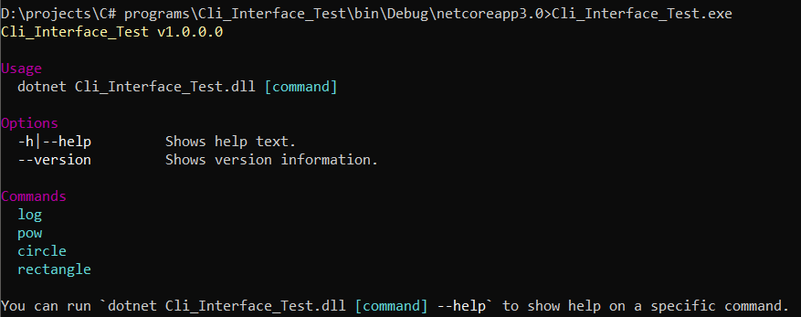
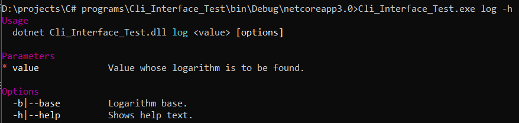

[](https://travis-ci.org/ghalib5000/Basic_Unit_Convertors)

# Basic Unit Convertors

a cli tool that has some basic unit convertors such as
- area finder
- volume finder
- length convertors
- price convertors
- log
- power

this requires that you install [.net core 3.0](https://dotnet.microsoft.com/download/dotnet-core/3.0)

# Usage
open the command prompt in the release folder and type in
```cmd
Cli_Interface_Test
```
you'll then see a list of currently implemented commands


Now just type in the command for example
```cmd
Cli_Interface_Test.exe pow 3
```
it will return the square of 3

you can also overrie this by specifiying it as
```cmd
Cli_Interface_Test.exe pow 3 -p 3
```
now it will return the cube of 3

you can check for how to use commands like this
for example for log command
```cmd
Cli_Interface_Test.exe log -h
```


the are more functions to come in the future...